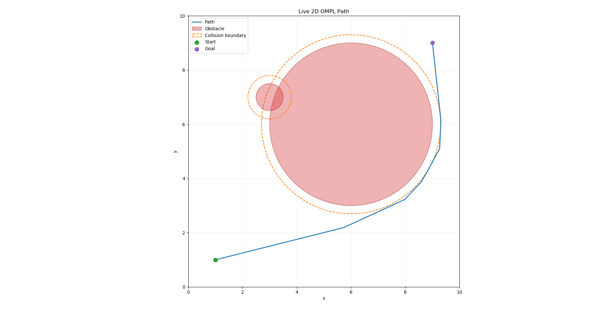

# OMPL Examples

This package contains small OMPL examples built with catkin.

## 2D Planning Example

The `plan_2d` executable demonstrates a minimal 2D path planning problem:

- A bounded `RealVectorStateSpace` with `x` and `y` coordinates in `[0, 10]`
- Hardcoded circular obstacles
- A state validity checker that rejects states inside obstacles
- An `RRTConnect` planner
- Console output for the solved path

Reusable obstacle and path-printing helpers live in `include/ompl_examples/planning_2d.h` and `src/planning_2d.cpp`.

## Dependencies

Install OMPL, YAML parsing, and plotting dependencies before building:

```bash
sudo apt-get update
sudo apt-get install ros-noetic-ompl libyaml-cpp-dev python3-yaml python3-matplotlib
```

## Build

From the catkin workspace root:

```bash
catkin build ompl_examples
```

## Run

After sourcing the workspace:

```bash
source devel/setup.bash
rosrun ompl_examples plan_2d
```

Run with the default YAML world config:

```bash
rosrun ompl_examples plan_2d $(rospack find ompl_examples)/config/plan_2d_world.yaml /tmp/plan_2d_path.csv
```

Or run the same configured example through launch:

```bash
roslaunch ompl_examples plan_2d.launch
```

The YAML config also includes a circular robot model:

```yaml
robot:
  radius: 0.2
  safety_margin: 0.1
```

The planner checks obstacles with an effective collision radius of `obstacle.radius + robot.radius + robot.safety_margin`. The plot shows the physical obstacle and the inflated collision boundary.

## ROS Path Topic

Run the ROS planner publisher:

```bash
roslaunch ompl_examples plan_2d_ros.launch
```

The node publishes the solved path as `nav_msgs/Path` on `/ompl_examples/path` using the `map` frame by default. The publisher is latched, so subscribers that start later still receive the latest planned path.

Inspect the published path:

```bash
rostopic echo /ompl_examples/path
```

Run the same workflow with the live matplotlib plotter:

```bash
roslaunch ompl_examples plan_2d_ros.launch show_plotter:=true
```

Save one live plot image from the topic without opening an interactive window:

```bash
roslaunch ompl_examples plan_2d_ros.launch show_plotter:=true plot_output:=/tmp/live_plan_2d_path.png plot_once:=true
```

The ROS node can still write a CSV if `output_csv` is set:

```bash
roslaunch ompl_examples plan_2d_ros.launch output_csv:=/tmp/plan_2d_path.csv
```

## Plot

Generate a path CSV and save a plot image:

```bash
rosrun ompl_examples plan_2d $(rospack find ompl_examples)/config/plan_2d_world.yaml /tmp/plan_2d_path.csv
rosrun ompl_examples plot_2d_path.py /tmp/plan_2d_path.csv --config $(rospack find ompl_examples)/config/plan_2d_world.yaml --output /tmp/plan_2d_path.png
```

If you edit the YAML world config, regenerate the CSV before plotting. The plotter validates the CSV path against the configured collision boundaries and reports an error if they do not match.

Omit `--output` to open an interactive matplotlib window instead.

## Example Result

The repository includes a sample output generated from the 2D planning example:

- Path CSV: [results/plan_2d/plan_2d_path.csv](results/plan_2d/plan_2d_path.csv)
- Plot image: [results/plan_2d/plan_2d_path.png](results/plan_2d/plan_2d_path.png)


